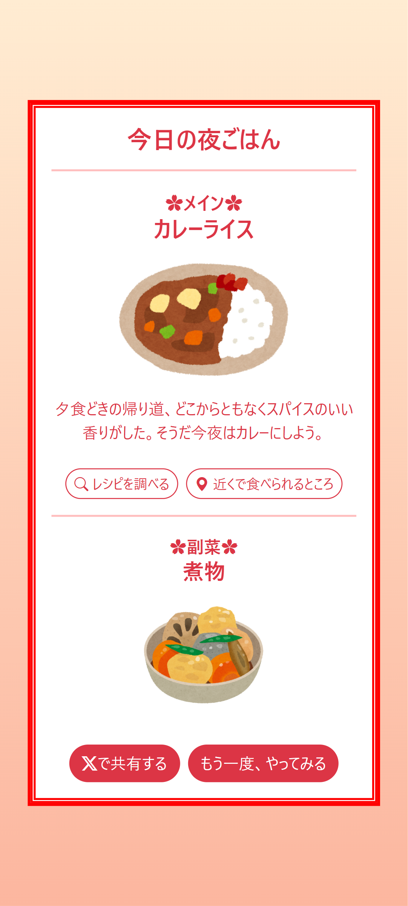

# くじ引き夜ごはん！ 今日の運命メニュー

🍽 **今日の晩ごはん、どうする？**
このアプリは、「今日の夕食、何にしよう？」と迷っているあなたのためのツールです。

## 🍳 主な機能
- ✅ **ワンクリックで主菜を提案** 🍛
- ✅ **レシピサイトへのリンク** 📖
- ✅ **近くで食べられる場所のマップ表示** 📍

🍽 今日のごはんに迷ったら、ぜひ活用してみてください！

## 👉 [**今すぐアプリを試す！**](https://recursion-team2.github.io/lottery-dinner/)

### 📸 スクリーンショット
 


## 👨‍💻 開発チーム
- **[akemashita](https://github.com/akemashita)** - 🎨UI設計＆ ⚙️メインロジック実装
- **[chia3blue](https://github.com/chia3blue)** - 💡アイデア発案＆ 📊データ管理＆ 🖌️レイアウト調整
- **[tyz8250](https://github.com/tyz8250)** - 🛠️ロジック拡張＆ 📂データ整理・統合


---

## 開発者向け情報
このプロジェクトをローカル環境で動作させるには、**VSCodeのLive Server拡張機能** を利用するのが簡単です。

### セットアップ手順
1. リポジトリをクローン
   ```sh
   git clone https://github.com/recursion-team2/work-space.git
   ```

2. **VSCodeでフォルダを開く**
   - VSCodeを起動し、クローンしたディレクトリを開く

3. **Live Serverをインストール（未インストールの場合）**
   - **拡張機能パネル（Ctrl + Shift + X）** を開く
   - 検索バーに `Live Server` と入力し、インストール

4. **Live Serverを起動**
   - `index.html` を開く
   - **右下の「Go Live」ボタン** をクリック

5. **ブラウザで自動的に開くので、アプリを試す！** 🎉

### 使用技術
- **フロントエンド:** HTML, CSS, JavaScript
- **CSSフレームワーク:** Bootstrap
- **ホスティング:** GitHub Pages